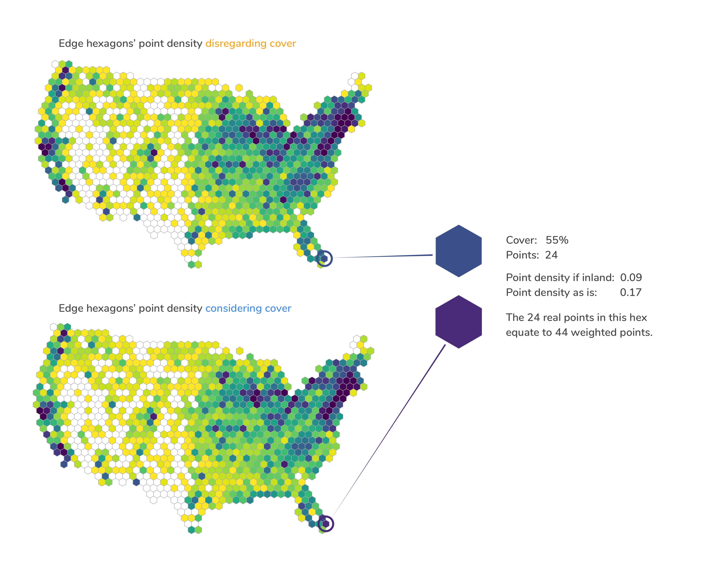
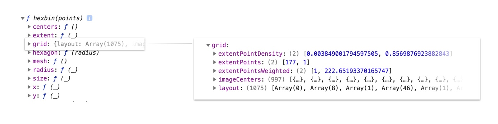
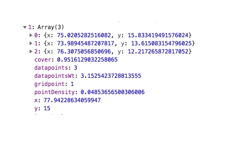
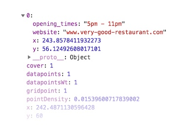
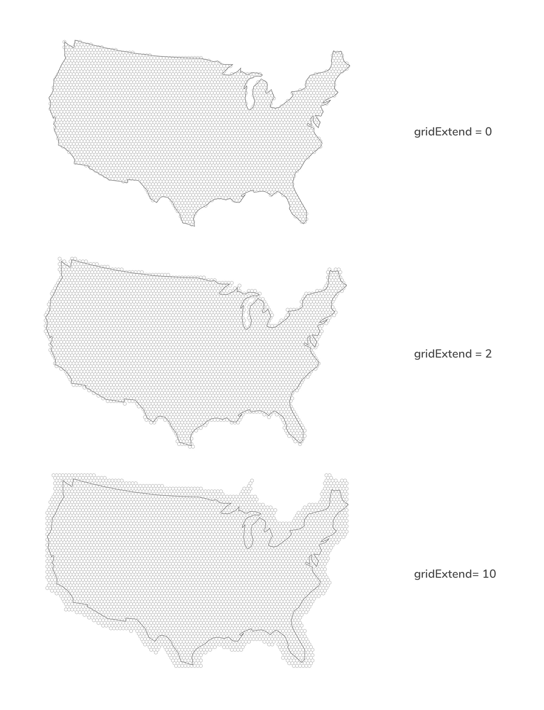
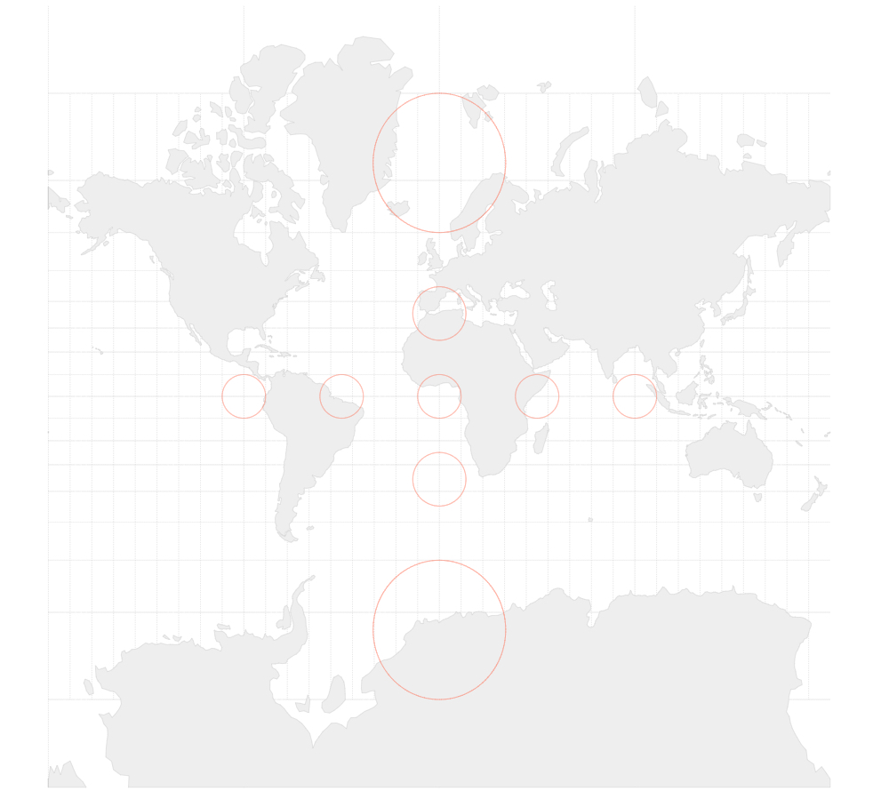

# d3-hexgrid

A wrapper of _d3-hexbin_, _**d3-hexgrid**_ does three things:

1. It allows you to [regularly tesselate](https://www.mathsisfun.com/geometry/tessellation.html) polygons with hexagons. _**d3-hexbin**_ produces hexagons where there is data. _**d3-hexgrid**_ produces hexagons where there is a base geography you define.

2. Hexagons at the edge of your geography are often truncated by the geography's border. _d3.hexgrid_ calculates the inside-area of these edge hexagons (_cover_) allowing you to encode edge data based on the correct point density. [See below for more](#cover-correction).

3. Lastly, _d3.hexgrid_ provides an extended layout generator for your point location data to simplify the visual encoding of your data. The layout rolls up the number of point locations per hexagon, adds cover and point density and provides a point count and point density extents for colour scale domains. [See below for more](#breaking-this-down:).

Please [see this notebook](LINK) LINK!! for a description of the algorithm.

## Examples

#### Militarised interstate disputes in Europe 1816-2001


<sub>data source: [Midloc via data.world](https://data.world/cow/militarized-dispute-locations/workspace/file?filename=midloc-v1-1%2FMIDLOC_1.1.csv)</sub>


#### Cities across the world


<sub>data source: [maxmind](http://www.maxmind.com/)</sub>

#### Farmers Markets in the US


<sub>data source: [USDA](https://www.ams.usda.gov/local-food-directories/farmersmarkets)</sub>

#### Postboxes in the UK 


<sub>data source: [dracos.co.uk](http://dracos.co.uk/) from [here](http://dracos.co.uk/made/locating-postboxes) via [Free GIS Data](https://freegisdata.rtwilson.com/)</sub>


### Cover correction

The tesselation aspect might become clear in these examples. The edge cover calculation might not. In short, _d3.hexgrid_ identifies all **edge hexagons** that partly lie beyond the borders of the geography &mdash; or more general, the base image presented. In a next step it calculates the edge hexagon's **cover**: the area the edge hexagon lies within the bounds of the base image in percent. Lastly, the **point density** will be calculated by: 

_Point density = Points in hexagon / Hexagon area in px<sup>2</sup> * Cover_

A comparison:



Both maps encode the number of Farmer's Markets per hexagon. Yellow represents a low, purple a high number. The edge hexagons of the upper map are not cover corrected, the edge hexagons of the lower map are. 

The edge hexagon at the south-eastern tip of Florida we're comparing has a cover of 55%, meaning 55% of the hexagon's area are inland, 45% are in the Atlantic. There are a total of 22 Farmer's Markets in this hexagon. Not cover corrected, the hexagon would have a point density of 0.09 and would receive a dark blue with the colour scale of choice. If cover corrected, its real point density increases to 0.17 and it is coloured in a dark purple - indicating higher point density as it should.

Differences might be subtle but are noticeable.

Please see [this notebook](LINK) LINK!! for a description of the overall algorithm in general and the cover calculation in particular. 


## Install

```
npm install d3-hexgrid
```

You can also download the build files [from here](TODO link).

Or you can use [unpkg](https://unpkg.com/) to script-link to _d3-hexgrid_:

```
<script src="https://unpkg.com/d3-hexgrid.js"></script>
```
TODO check if this works


## Example usage
Here's a bare bone example usage of _d3-hexgrid_.

```

// Container.
const svg = d3.select('#container')
	.append('svg')
	.attr(width, 'width')
	.attr('height, 'height');

// Geo data, projection and path.
const geo = topojson.feature(topo, topo.objects.us_mainland);
const projection = d3.geoAlbers().fitSize([width, height], geo);
const geoPath = d3.geoPath().projection(projection);

// Produce and configure the hexgrid instance.
const hexMaker = d3.hexgrid()
	.extent([width, height])
	.geography(geo)
    .projection(projection)
	.pathGenerator(geoPath);

// Get the hexbin generator and the layout. 
const hex = hexMaker(myPointLocationData);

// Create a colour scale.
const colourScale = d3.scaleSequential(d3.interpolateViridis)
	.domain(hex.grid.maxPoints.reverse()); 

// Draw the hexes.
svg.append('g')
	.selectAll('.hex')
	.data(hex.grid.layout)
	.enter()
	.append('path')
	.attr('class', 'hex')
	.attr('transform', d => `translate(${d.x} ${d.y})`)
	.attr('d', hex.hexagon())
	.style('fill', d => !d.datapoints ? '#fff' : colourScale(d.datapoints));


```

### Breaking the example down:

First, we create an `SVG` element. Let's assume our data represents mainland US and comes in as a TopoJSON. We first convert it to GeoJSON, use an Albers projection to fit our SVG and finally get the appropriate path generator.

```
const svg = d3.select('#container')
	.append('svg')
	.attr(width, 'width')
	.attr('height, 'height');

const geo = topojson.feature(topo, topo.objects.us_mainland);
const projection = d3.geoAlbers().fitSize([width, height], geo);
const geoPath = d3.geoPath().projection(projection);

```
Next, we use `d3.hexgrid()` to produce a _hexgrid_ instance we call `hexMaker`. We immediately configure it by passing in the extent, the GeoJOSN, the projection and the path-generator.

```
const hexMaker = d3.hexgrid()
	.extent([width, height])
	.geography(geo)
    .projection(projection)
	.pathGenerator(geoPath);
```
Now we can call our _hexgrid_ instance passing in our data. 

```
const hex = hexMaker(myPointLocationData);
```

This will return a hexbin generator as [`d3.hexbin()`](https://github.com/d3/d3-hexbin) does, augmented with an additional object called `grid`, which exposes the following properties:



* `imageCenters` is an array of all [x, y] hexagon centers of the hexgrid.

* `layout` is an array of arrays, each sub-array representing a hexagon in the grid. Each sub-array holds all point locations per hexagon in an object exposing at least _x_ and _y_ pixel coordinates as well as aggregate values. Here's an example hexagon layout object with three point locations or _datapoints_:

	
	
	The aggregate values per hexagon are:

	- `cover` is the percentage of this hexagon's area within the geography expressed as a number between 0 and 1.
	- `datapoints` is the number of points binned in the hexagon.
	- `datapointsWt` is the number of points weighted by the inverse cover.
	- `pointDensity` is the hexagon's point density.
	- `gridpoint` marks the hexagon as part of the initial hexgrid. This allows you to distinguish hexagons added by the data. Imprecise latitude and longitude data values can lead to the production of hexagons just outside the hexgrid. _d3.hexgrid_ will still capture and produce them. But you can spot and treat them by filtering for `gridpoint === 0`.
	- `x` and `y`are the hexagon center positions in pixel coordinates.

* `extentPoints` is the extent of point location counts over all hexagons in the form _[min number of points, max number of points]_.
* `extentPointsWeighted` is the extent of point location counts weighted by their cover over all hexagons in the form _[min number of weighted points, max number of weighted points]_.
* `extentPointDensity` is the extent of cover adjusted point density over all hexagons in the form _[min point density, max point density]_.

	These extents can be used to set the domain of a colour scale when encoding number of points or point density.

	
Working with points, for example, we might want to create the following colour scale:


```
const colourScale = d3.scaleSequential(d3.interpolateViridis)
	.domain(hex.grid.extentPoints.reverse()); 
```
Here, we decide to encode the number of points per hexagon as colours along the spectrum of the [viridis colour map](https://github.com/d3/d3-scale-chromatic#interpolateViridis) and create an appropriate colour scale. We reverse the extent as we want to map the maximum value to the darkest colour, which the viridis colour space starts with.

Finally, we build the visual:

```
svg.append('g')
	.selectAll('.hex')
	.data(hex.grid.layout)
	.enter()
	.append('path')
	.attr('class', 'hex')
	.attr('transform', d => `translate(${d.x} ${d.y})`)
	.attr('d', hexgrid.hexagon())
	.style('fill', d => !d.datapoints ? '#fff' : colourScale(d.datapoints));

```
We use the `hex.grid.layout` to produce as many path's as there are hexagons - as we would with `d3.hexbin()` - now, however, making sure we have as many hexagons to cover our entire GeoJSON polygon. We `translate` them into place and draw them with `hexgrid.hexagon()`. Lastly, we give our empty hexagons (`!d.datapoints`) a white fill and colour encode all other hexagons depending on their number of `datapoints`.


## API Reference


<a href="#hexgrid" name="hexgrid">#</a> d3.<b>hexgrid</b>()

Constructs a hexgrid generator called _hexgrid_ in the following. To be configured before calling it with the data you plan to visualise. 


<a href="#hex" name="hex">#</a> _hexgrid(⟨ data ⟩ [, ⟨ names ⟩])_

Generates a hexbin generator augmented with a `grid` property, exposing the hexagon layout data as well as extents for point and point density measures. See [Example usage](#example-usage) for details. Optionally _⟨ names ⟩_ can be an array of strings, listing properties you would like to pass through from your original data to the grid layout.

Assuming you want to visualise restaurants on a map and have a restaurant dataset containing the variables `website` and `opening_times` you can say:

```
hexgrid(restaurantData, ['website', 'opening_times'])
```

As a result, objects in the <code>_hexgrid_.grid.layout</code> array will contain the two variables in addition to the default _x_ and _y_ coordinates:



<a href="#hex-extent" name="hex-extent">#</a> _hexgrid._<b>extent</b>(⟨ _Array_ ⟩)

_Required_. Sets the extent of the hexbin generator produced internally. ⟨ _Array_ ⟩ can come as either a 2D array specifying start and end point [[x₀, y₀], [x₁, y₁]], where x₀ is the left side of the bounding box, y₀ is the top, x₁ is the right and y₁ is the bottom. Alternatively ⟨ _Array_ ⟩ can be specified as an array of just width and height [x₁, y₁] with the top-left corner assumed to be [0, 0]. The following two statements are equivalent:

```
hexgrid.extent([[0, 0], [width, height]]);
hexgrid.extent([width, height]);
```


<a href="#hex-geography" name="hex-geography">#</a> _hexgrid._<b>geography</b>(⟨ _object_ ⟩)

_Required_. ⟨ _object_ ⟩ represents the base polygon for the hexgrid in GeoJSON format. If you were to project a hexgrid onto Bhutan, ⟨ _object_ ⟩ would be a GeoJSON object of Bhutan. 


<a href="#hex-projection" name="hex-projection">#</a> _hexgrid._<b>projection</b>(⟨ _function_ ⟩)

_Required_. ⟨ _function_ ⟩ is the projection function for the previously defined _geography_ commonly specified within the bounds of _extent_. See [here](https://github.com/d3/d3-geo) or [here](https://github.com/d3/d3-geo-projection) for a large pond of projection functions.


<a href="#hex-pathGenerator" name="hex-pathGenerator">#</a> _hexgrid._<b>pathGenerator</b>(⟨ _function_ ⟩)

_Required_. ⟨ _function_ ⟩ is the path generator to produce the drawing instructions of the previously defined _geography_ based on the also previously defined _projection_.


<a href="#hex-hexRadius" name="hex-hexRadius">#</a> _hexgrid._<b>hexRadius</b>(⟨ _number_ ⟩)

_Optional_. The desired hexagon radius in pixel. Defaults to 4.


<a href="#hex-edgePrecision" name="hex-edgePrecision">#</a> _hexgrid._<b>edgePrecision</b>(⟨ _number_ ⟩)

_Optional_. The edge precision sets the size of the internally produced canvas to identify which area of the edge hexagon is covered by the geography. The higher the precision, the better the pixel detection at the hexagon edges. Values can be larger than 1 for small visuals. Values smaller than 0.3 will be coerced to 0.3. The default value of 1 will be fine for most purposes.


<a href="#hex-gridExtend" name="hex-gridExtend">#</a> _hexgrid._<b>gridExtend</b>(⟨ _number_ ⟩)

_Optional_. _gridExtend_ controls the size of the base geography. _gridExtend_ allows you to "inflate" your geography and can be used to draw more hexagons around the edges that otherwise would not be drawn.



_gridExtend_ is measured in units of _hexRadius_. For example, a _gridExtend_ value of 2 would extend the grid by _2 &times; hexRadius_ pixel.


<a href="#hex-geoKeys" name="hex-geoKeys">#</a> _hexgrid._<b>geoKeys</b>(⟨ _Array_ ⟩)

_Optional_. _d3.hexgrid_ will try to guess the key names for longitude and latitude variables in your data. The following case-insensitive key names will be sniffed out: 

* _longitude_, _long_, _lon_, _lng_, _lambda_ as well as 
* _latitude_, _lat_ and _phi_.

If you choose other names for them like for example _upDown_ and _leftRight_, you 
have to specify them as <code><i>hexgrid</i>.geokeys(['upDown', 'leftRight'])</code> with the first element representing longitude and the second latitude. 

Please don't call your geo keys `x` or `y` or otherwise include `x` or `y` keys in your passed in user variables as they are reserved keys for the pixel coordinates of the layout.

## Using hexagons in mapping

Hexagons are good for binning point location data as they are the shape closest to circles that can be regularly tesselated. AS a result point distributions within the hexagon are [relatively spike-less](LINK) LINK! and [neighbouring hexagons are equidistant](https://uber.github.io/h3/#/documentation/overview/use-cases). 

However, the world is [something like a sphere](https://en.wikipedia.org/wiki/Spheroid) and there are numerous ways to project a sphere onto a 2D plane. The projection used has an important effect on the analysis. Any tesselation normalises space to equally sized units - hexagons in this case - which invites considering these units the same size. However, some projections like the ubiquitous Mercator projection will distort the area towards the poles significantly:



<sub>All red circles are of the same area. Source: [D3 in depth](http://d3indepth.com/geographic/) by [Peter Cook](http://animateddata.co.uk/)

Tesselating a mercator world map with hexagons will produce many more hexagons per square mile in Norway compared to Brazil. 

Instead, consider using an [equal area projections](https://github.com/d3/d3-geo-projection#geoConicEqualArea) which reduces the problem dramatically.

Another caveat with location binning is the [Modifiable Areal Unit Problem](https://blog.cartographica.com/blog/2011/5/19/the-modifiable-areal-unit-problem-in-gis.html) or MAUP, stating that a change in size of the analysis units can lead to different results. Something to be aware of, a reason to analyse the same data with different sizes, and - if appropriate - explain found differencies to the user, maybe by showing results with different sizes or even allowing the aware user to change the hexagon sizes.


