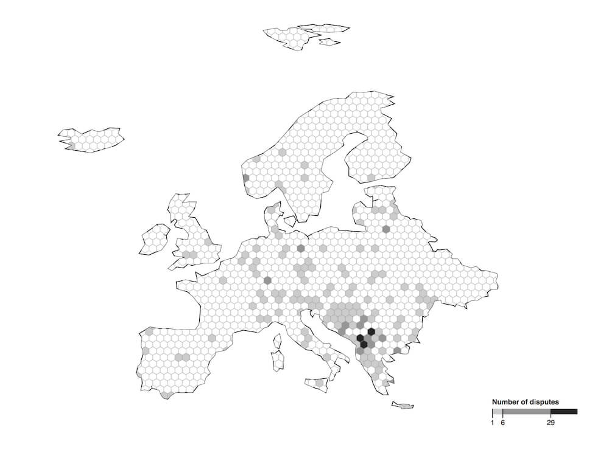
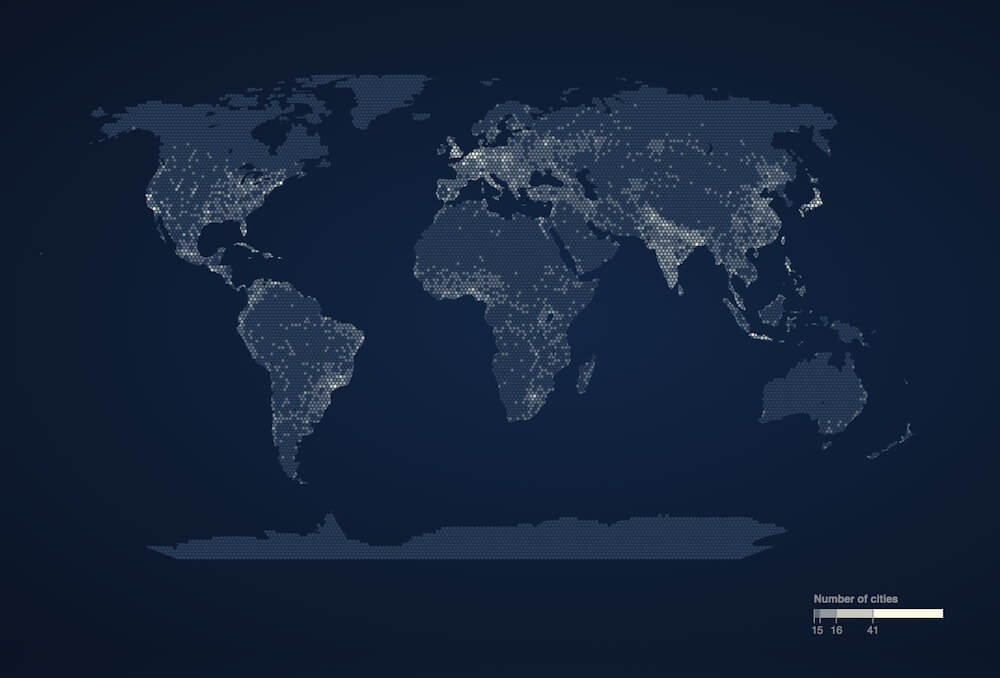
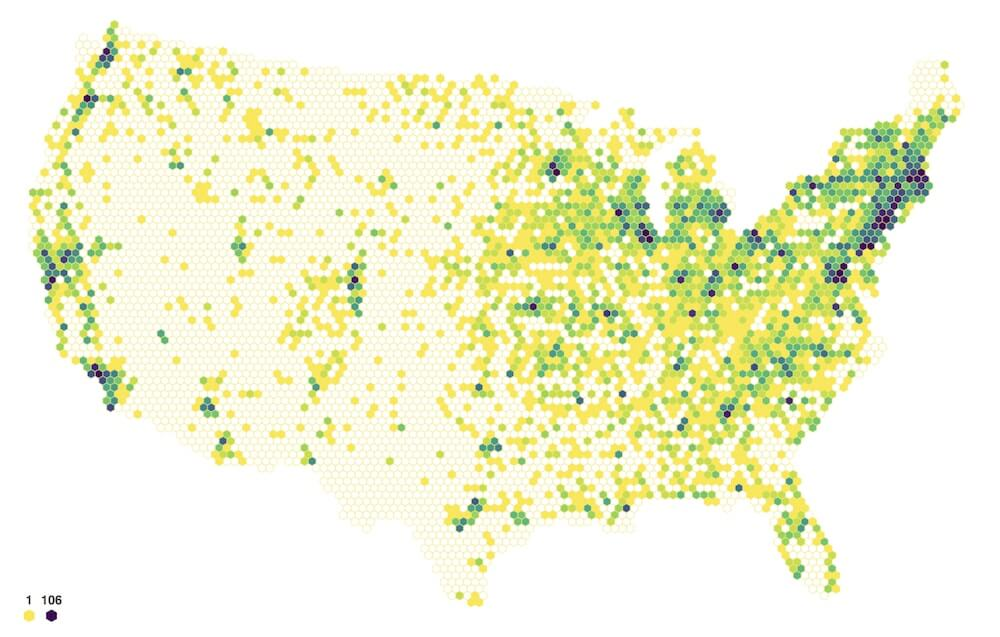
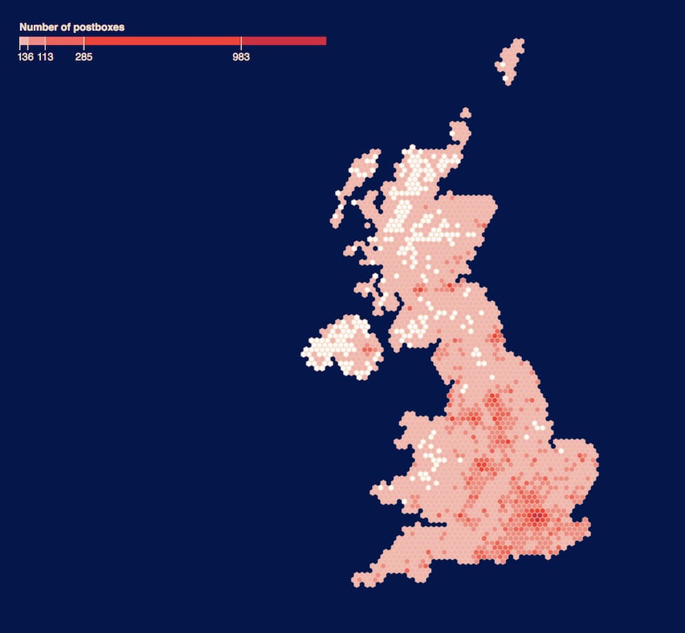

# d3-hexgrid

A wrapper of _d3-hexbin_, _d3-hexgrid_ allows you to regularly tesselate polygons with hexagons. 

It further provides a layout generator for your point location data returning point counts per hexagon simplifying the visual encoding of your data.

## Examples

Militarised interstate disputes in Europe 1816-2001



<sub>data source: [Midloc via data.world](https://data.world/cow/militarized-dispute-locations/workspace/file?filename=midloc-v1-1%2FMIDLOC_1.1.csv)</sub>

Cities across the world



<sub>data source: [maxmind](http://www.maxmind.com/)</sub>

Farmers Markets in the US



<sub>data source: [USDA](https://www.ams.usda.gov/local-food-directories/farmersmarkets)</sub>

Postboxes in the UK 



<sub><i>NI data seemingly incomplete</i>. Anyway.. data source: [dracos.co.uk](http://dracos.co.uk/made/locating-postboxes/export.php) via [Free GIS Data](https://freegisdata.rtwilson.com/)</sub>

TODO: link to blocks

It might be obvious that _d3-hexgrid_ is build with geographic map tesselation in mind. However, nothing should stop you to tesselate non-geographic polygons as long as you represent the data in GeoJSON or TopoJSON (see more [below](TODO link)).

## Install

```
npm install d3-hexgrid
```

Alternatively, you can download the build files [from here](TODO link).

Lastly, you can use [unpkg](https://unpkg.com/) to script-link to _d3-hexgrid_:

```
<script src="https://unpkg.com/d3-hexgrid.js"></script>
```
TODO check if this works


## Example usage
Here's a bare bone example usage of _d3-hexgrid_.

```

// Container.
const svg = d3.select('#container').append('svg')

// Geo data, projection and path.
const geo = topojson.feature(topo, topo.objects.us_mainland);
const projection = d3.geoAlbers().fitSize([width, height], geo);
const geoPath = d3.geoPath().projection(projection);

// Produce and configure the hexgrid instance.
const hexMaker = d3.hexgrid()
	.geography(geo)
    .projection(projection)
	.pathGenerator(geoPath);

// Get the hexbin generator and the layout. 
const hexgrid = hexMaker(myPointLocationData);

// Create a colour scale.
const colourScale = d3.scaleSequential(d3.interpolateViridis)
	.domain([hexgrid.maximum, 1]); 

// Draw the hexes.
svg.append('g')
	.selectAll('.hex').data(hexgrid.layout)
	.enter().append('path')
	.attr('class', 'hex')
	.attr('transform', d => `translate(${d.x} ${d.y})`)
	.attr('d', hexgrid.hexagon())
	.style('fill', d => !d.datapoints ? '#fff' : colourScale(d.datapoints));


```

Breaking this down:

First, we create an `SVG` element. Let's assume our data represents mainland US and comes in as a TopoJSON. We first convert it to GeoJSON, use an Albers projection to fit our SVG and finally get the appropriate path generator.

```
const svg = d3.select('#container').append('svg')
	.attr(width, 'width').attr('height, 'height')

const geo = topojson.feature(topo, topo.objects.us_mainland);
const projection = d3.geoAlbers().fitSize([width, height], geo);
const geoPath = d3.geoPath().projection(projection);

```
Next, we use `d3.hexgrid()` to produce a _hexgrid_ instance we call `hexMaker`. We immediately configure it by passing in the GeoJOSN, the projection and the path-generator.

```
const hexMaker = d3.hexgrid()
	.geography(geo)
    .projection(projection)
	.pathGenerator(geoPath);
```
Now we can call our _hexgrid_ instance passing in our data. This will return a hexbin generator as [`d3.hexbin()`](https://github.com/d3/d3-hexbin) does, augmented with two additional properties `layout` and `maximum`.  

```
const hexgrid = hexMaker(myPointLocationData);
```

`layout` is an array of objects, each representing one hexagon. Each object will hold all data items per hexagon as well as a property called `datapoints` exposing the number of datapoints for this hexagon. 


```
const colourScale = d3.scaleSequential(d3.interpolateViridis)
	.domain([hexgrid.maximum, 1]); 
```
We decide to encode the number of points per hexagon as colours along the spectrum of the [viridis colour  map](https://github.com/d3/d3-scale-chromatic#interpolateViridis) and create an appropriate colour scale. Here, we use the second property exposed by our hex generator, `hexgrid.maximum`, holding the maximum number of points for all hexagons. 

Finally, we build the visual:

```
svg.append('g')
	.selectAll('.hex')
	.data(hexgrid.layout)
	.enter()
	.append('path')
	.attr('class', 'hex')
	.attr('transform', d => `translate(${d.x} ${d.y})`)
	.attr('d', hexgrid.hexagon())
	.style('fill', d => !d.datapoints ? '#fff' : colourScale(d.datapoints));

```
We use the `hexgrid.layout` to produce as many path's as there are hexagons - as we would with `d3.hexbin()`, now, however, making sure we have as many hexagons to cover our entire GeoJSON polygon. We `translate` them into place and draw them with `hexgrid.hexagon()`. Lastly, we give our empty hexagons (`!d.datapoints`) a white fill and colour encode all other hexagons depending on their number of `datapoints`.


## API Reference

API documentation. Use bold for symbols (such as constructor and method names) and italics for instances. See the other D3 modules for examples.

<a href="#hexgrid" name="hexgrid">#</a> <b>hexgrid</b>()

Fun and games with hexagonal tesselation
